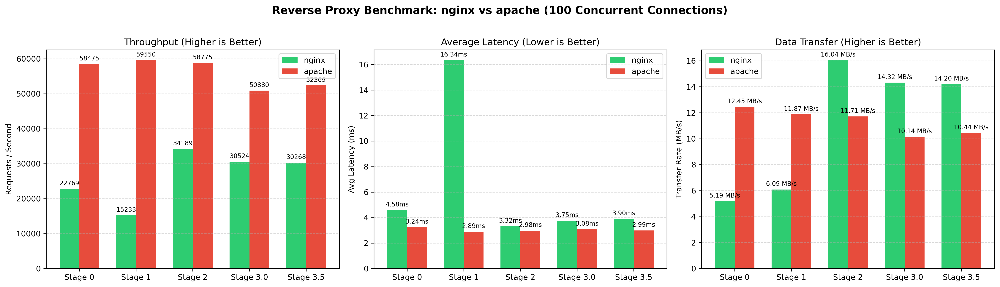
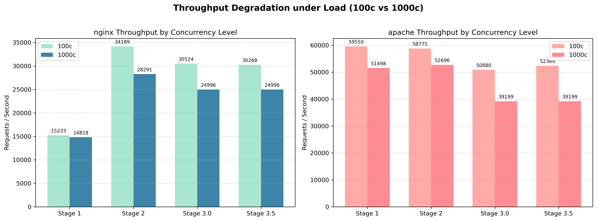
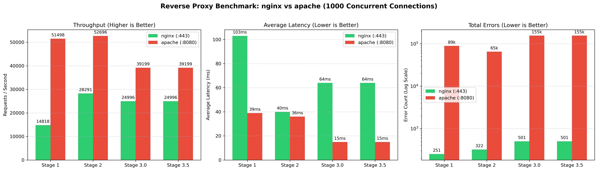

# Proxy-Climb

A hands-on exploration of reverse proxies, network concurrency, and system bottlenecks — built on a single laptop, deliberately constrained, and stress-tested until things broke.

The setup: NGINX fronting Apache HTTPD, hammered with a custom Go benchmarking tool, scaled from normal traffic to the point of socket exhaustion. Each stage tightened one layer of the stack and revealed something the previous stage didn't.

---

## The Machine

**Omen 15-ax252nr** — Intel i7-7700HQ, 4 physical cores, 8 threads

**OS:** Arch Linux, serving from `/srv/http/`

**Stack:** NGINX (frontend proxy) → Apache HTTPD (backend)

**Load testing:** `wrk` + a custom Go orchestrator (replaced JMeter early — too much Java overhead on a single-host test environment)

---

## Stage by Stage

### Stage 0: Bare Minimum Baseline

No default configs. Built from scratch to understand what the proxy layer actually costs before adding anything on top of it.

Apache's "Big 4" modules (`mpm_event`, `proxy`, `ssl`, `rewrite`) turned out to be the minimum viable foundation — without them, nothing starts. With nothing tuned, NGINX imposed a measurable throughput penalty of roughly 40–60%, but held the line on errors even when Apache started dropping connections. The proxy layer was slower, but structurally more stable. That tradeoff is the whole point of a reverse proxy.

Tooling note: switched from JMeter to `wrk` and `ab` (both C-based) to eliminate benchmarking overhead competing with the thing being benchmarked. Also built a Go orchestrator — using a Director/Experts pattern — to manage test runs cleanly across stages.

### Stage 1: Security Hardening and the Hardware Constraint

Added the standard hardening layer: server version suppression, `X-Frame-Options: SAMEORIGIN`, `X-Content-Type-Options: nosniff`, CSP, and `mod_remoteip` so NGINX correctly forwards the client's real IP via `X-Forwarded-For`.

The more important finding was about the test environment itself. NGINX, Apache, and `wrk` all share the same 4 physical cores. Performance drops here weren't always configuration problems — they were CPU context-switching overhead from three competing processes on the same physical hardware. That constraint shaped how every result from this point forward was interpreted: observed numbers are a floor, not a ceiling.

Worker tuning: NGINX set to 4 workers (matching physical cores) with 2048 connections. Apache MPM Event raised to `ServerLimit 25` / `MaxRequestWorkers 1200` to accommodate the 1000c stress test without artificial worker exhaustion.

### Stage 2: HTTPS, TLS Termination, and Backlog Tuning

Generated a local 2048-bit RSA certificate via OpenSSL. NGINX handles TLS termination at the edge — encryption/decryption stays there, Apache sees plain HTTP internally. Forced HTTP-to-HTTPS redirect, switched to HTTP/2 (`http2 on;` on NGINX 1.25.x+).

Additional hardening: HSTS enforced for 1 year, `ssl_ecdh_curve secp384r1` for efficient key exchange, `ssl_prefer_server_ciphers on`, buffer overflow mitigations on client body and header sizes, `TraceEnable Off` on Apache to close the XST vector.

The most measurable win: tuning OS connection backlogs (`somaxconn`, `tcp_max_syn_backlog`) cut worst-case latency under peak load from 1.10s down to 825ms. That single OS-level change outperformed any application-layer config change in this stage — and Stage 2 NGINX ends up as the best-performing configuration at 1000c by a significant margin.

### Stage 3.0: Firewall, Conntrack, and the Stability Paradox

Applied a strict `iptables` policy: default INPUT DROP, allow loopback and established connections, drop invalid packets, rate-limit SYN floods on :443 (`--limit 30/s --limit-burst 60`), hard connection cap (`--connlimit-above 40 -j DROP`).

The expected result was a performance penalty. The actual result was improved stability under high concurrency.

The mechanism: `conntrack` usage stayed low (~125 active entries, nowhere near the 262,144 limit), so the firewall overhead was processing-based rather than capacity-based — small and predictable. Meanwhile, the rate limits and connection caps were acting as an unintentional traffic shaper. By throttling connection surges before they reached NGINX, the firewall prevented the kernel socket queue saturation that was causing instability in earlier stages. The firewall wasn't helping application performance — it was preventing the OS from being overwhelmed before the application even saw the traffic.

At 1000c, the firewall becomes essentially irrelevant as a bottleneck. Kernel socket pressure and NGINX worker contention dominate completely. The firewall's ~10–13% overhead at 100c disappears as a concern when latency is spiking and read errors hit six figures.

Tested loopback bypass (`NOTRACK` on the raw table) to remove loopback traffic from conntrack overhead entirely. Worth noting for future tuning.

### Stage 3.5: Event MPM and the Staged Go Decision

Tuned Apache's Event MPM as an isolated experiment: better keepalive handling, reduced thread blocking, improved concurrency efficiency under load.

The original plan here was to introduce a Go mid-layer — a BFF (Backend for Frontend) sitting between NGINX :443 and Apache :8080. The design rationale was sound: Go goroutines as cheap connection multiplexing to bridge NGINX's event-driven model and Apache's heavier process model. The Go layer would hold connection state in memory, batch upstream requests to Apache, and provide a programmable routing layer. The C/embedded link was intentional too — understanding how Go copies bytes between request and response objects is a direct conceptual bridge to `memcpy()` and manual pointer arithmetic in C.

The reason it didn't ship in this stage: introducing a half-built abstraction layer with no clean baseline would have made every subsequent result uninterpretable. A Go layer tested against unresolved Apache MPM behavior isn't an experiment — it's noise. The MPM tuning needed to land first. It's now sequenced correctly.

---

## Raw Data

### 100 Connections — Baseline Load

At 100 simultaneous connections, Apache behaves like a steady sink — throughput barely moves across all stages (~50–59k RPS), latency is almost flat. NGINX is where the configuration changes show up. Stage 1 is the worst performer (security headers + worker tuning mid-flight); Stage 2 is the best, where SSL termination and HTTP/2 multiplexing more than offset the encryption cost.

**NGINX :443 / :80**

| Stage | Req/sec | Avg Latency | Max Latency | Transfer/sec |
| :--- | :---: | :---: | :---: | :---: |
| Stage 0 — Baseline | 22,768 | 4.58 ms | 77.37 ms | 5.19 MB/s |
| Stage 1 — Hardened | 15,232 | 16.34 ms | 145.88 ms | 6.09 MB/s |
| Stage 2 — SSL Tuned | 34,188 | 3.32 ms | 163.57 ms | 16.04 MB/s |
| Stage 3.0 — Firewall | 30,523 | 3.75 ms | 93.14 ms | 14.32 MB/s |
| Stage 3.5 — Event MPM | 30,267 | 3.90 ms | 121.96 ms | 14.20 MB/s |

**Apache :8080**

| Stage | Req/sec | Avg Latency | Max Latency | Transfer/sec | Errors |
| :--- | :---: | :---: | :---: | :---: | :---: |
| Stage 0 — Baseline | 58,475 | 3.24 ms | 39.43 ms | 12.45 MB/s | 22 |
| Stage 1 — Hardened | 59,550 | 2.89 ms | 28.44 ms | 11.87 MB/s | 0 |
| Stage 2 — High-Limit | 58,774 | 2.98 ms | 31.79 ms | 11.71 MB/s | 0 |
| Stage 3.0 — Firewall | 50,879 | 3.08 ms | 30.49 ms | 10.14 MB/s | 0 |
| Stage 3.5 — Event MPM | 52,369 | 2.99 ms | 30.17 ms | 10.44 MB/s | 0 |

### 1000 Connections — Stress Test

At 10× load, the architectural difference stops being subtle. Apache's raw speed advantage collapses under error volume. NGINX holds throughput but latency climbs hard.

Stage 2 is the standout: backlog tuning brought max latency down to 825ms and NGINX hit its highest 1000c RPS of any stage. Adding the firewall in Stage 3.0 actually hurt NGINX throughput slightly while Apache's error count got worse — the connection caps were dropping legitimate traffic at this volume.

**NGINX :443**

| Stage | Req/sec | Avg Latency | Max Latency | Std Dev | Errors |
| :--- | :---: | :---: | :---: | :---: | :---: |
| Stage 1 — Hardened | 14,818 | 103 ms | 1.10 s | 121 ms | 251 |
| Stage 2 — SSL Tuned | 28,291 | 40 ms | 825 ms | 66 ms | 322 |
| Stage 3.0 — Firewall | 24,996 | 64 ms | 1.34 s | 143 ms | 501 |
| Stage 3.5 — Event MPM | 24,996 | 64 ms | 1.34 s | 143 ms | 501 |

**Apache :8080**

| Stage | Req/sec | Avg Latency | Max Latency | Std Dev | Errors |
| :--- | :---: | :---: | :---: | :---: | :---: |
| Stage 1 — Hardened | 51,498 | 39 ms | 1.71 s | 73 ms | ~89,000 |
| Stage 2 — High-Limit | 52,696 | 36 ms | 226 ms | 48 ms | ~65,000 |
| Stage 3.0 — Firewall | 39,199 | 15 ms | 230 ms | 17 ms | 155,446 |
| Stage 3.5 — Event MPM | 39,199 | 15 ms | 230 ms | 17 ms | 155,446 |

The failure mode is kernel socket queue saturation — connections arriving faster than the accept queue can process them, with `ulimit` and `somaxconn` defaults acting as hard ceilings. This is an OS-level constraint, not an application one.

---

## What This Actually Demonstrated

**Raw throughput metrics are incomplete.** Apache's numbers look better until you look at what it's dropping to produce them. Speed without stability isn't a win at scale.

**Firewalls can stabilize systems, not just protect them.** The `iptables` rules added for security had a structural side effect: rate-limiting connection surges before they reached NGINX prevented the kernel socket exhaustion that was causing instability. The firewall was doing traffic shaping without being configured as a traffic shaper.

**The firewall overhead is predictable; the kernel ceiling is not.** At 100c, the firewall costs about 10–13% throughput. At 1000c, that overhead becomes irrelevant — the system is constrained by socket backlog saturation and CPU contention, not packet inspection. These are different failure regimes.

**OS parameters are configuration too.** The biggest latency improvement in Stage 2 came from tuning `somaxconn` and `tcp_max_syn_backlog`, not from any application-layer change. The application sits on top of the kernel; the kernel is a tunable layer, not a fixed constraint.

---

## Where I'm Heading Next

**Kernel parameter tuning (Stage 4).** `somaxconn`, `tcp_max_syn_backlog`, `ip_local_port_range`, and `tcp_tw_reuse` are all in scope. The 1000c failure mode is a kernel socket backlog problem — the question is how much headroom proper `sysctl` tuning can buy before the hardware ceiling takes over. Can Apache survive 1000c without firewall-level connection drops compensating for it?

**iptables vs. nftables.** Direct comparison under identical rulesets. Given the traffic-shaping behavior observed in Stage 3, this is more interesting than a raw throughput comparison — the question is whether the stability effect holds under nftables, and whether the processing efficiency difference is measurable at realistic load.

**The Go mid-layer, properly sequenced.** The design: Go on :8081 between NGINX :443 and Apache :8080, using goroutines to multiplex upstream connections and decouple connection management from request execution. Now that Apache MPM baselines are clean, the Go layer has well-defined inputs to test against. The embedded/C link is deliberate — Go's byte-copy mechanics between request and response objects are a direct conceptual bridge to `memcpy()` and pointer arithmetic.

**Embedded/C transition.** The resource-constraint thinking from this project — CPU contention, kernel socket limits, memory boundaries, scheduler behavior — maps directly to embedded systems work. The lower-level projects in this portfolio build from here.

---

Full stage-by-stage notes, raw benchmark output, and OS configuration details live in [`docs/`](docs/).
